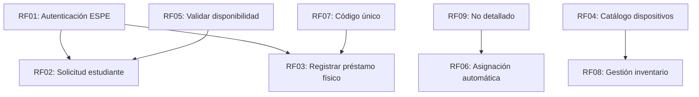

# Cronograma del Proyecto - Sprint 1
**Grupo 2 - ADS**  
**Fecha**: 10 de diciembre de 2025  
**Versión**: 1.0

---

## 📊 Resumen Ejecutivo

- **Duración del Sprint**: 7 días (Sábado a Viernes)
- **Total de Horas Estimadas**: 49 horas
- **Requerimientos Funcionales**: 8 (RF01 - RF08)
- **Subtareas Totales**: 21
- **Equipo**: Moisés Benalcázar, Stefany Díaz, Mateo Medranda

---

## 📅 Distribución de Trabajo por Día

### **Día 1 - Viernes** (4 horas)
- **RF08-1**: CRUD dispositivos (2 horas)
- **RF08-2**: Cambiar estado dispositivo (2 horas)

### **Día 2 - Jueves** (2 horas)
- **RF07-1**: Generar código único (1 hora)
- **RF07-2**: Mostrar código al usuario (1 hora)

### **Día 3 - Miércoles** (5 horas)
- **RF01-3**: Conectar API Banner (1 hora)
- **RF05-1**: Validar estado en tiempo real (1 hora)
- **RF06-3**: Confirmación en UI (1 hora)
- **RF03-1**: UI panel técnico (1 hora)
- **RF08-1**: CRUD dispositivos (1 hora)

### **Día 4 - Martes** (12 horas)
- **RF05-2**: Mostrar alerta si no hay stock (2 horas)
- **RF06-1**: Algoritmo de selección (1 hora)
- **RF06-2**: Actualizar estado a Prestado (1 hora)
- **RF02-3**: Validar franja horaria (1 hora)
- **RF03-1**: UI panel técnico (1 hora)
- **RF03-3**: Registrar devolución (1 hora)
- **RF04-2**: Filtros por tipo/estado (1 hora)
- **RF08-1**: CRUD dispositivos (2 horas)
- **RF08-2**: Cambiar estado dispositivo (2 horas)

### **Día 5 - Lunes** (19 horas)
- **RF01-1**: Implementar vista UI (1 hora)
- **RF01-3**: Conectar API Banner (1 hora)
- **RF01-4**: Mensajes de error y redirección por rol (1 hora)
- **RF02-2**: Selección de franja y dispositivo (1 hora)
- **RF02-3**: Validar franja horaria (1 hora)
- **RF03-1**: UI panel técnico (2 horas)
- **RF03-2**: Registrar entrega con código (1 hora)
- **RF03-3**: Registrar devolución (2 horas)
- **RF04-1**: Vista catálogo (2 horas)
- **RF04-2**: Filtros por tipo/estado (2 horas)
- **RF05-1**: Validar estado en tiempo real (1 hora)
- **RF06-1**: Algoritmo de selección (1 hora)
- **RF06-2**: Actualizar estado a Prestado (1 hora)
- **RF06-3**: Confirmación en UI (2 horas)

### **Día 6 - Domingo** (6 horas)
- **RF01-2**: Validar dominio @espe.edu.ec (1 hora)
- **RF02-1**: Cargar horario desde Banner (2 horas)
- **RF02-2**: Selección de franja y dispositivo (1 hora)
- **RF03-2**: Registrar entrega con código (1 hora)
- **RF06-1**: Algoritmo de selección (1 hora)

### **Día 7 - Sábado** (1 hora)
- **RF02-1**: Cargar horario desde Banner (1 hora)

---

## 🎯 Requerimientos Funcionales Detallados

### **RF01: Autenticación ESPE** (5 horas) - Alta Prioridad
**Responsable**: No asignado  
**Dependencias**: Ninguna  
**Estado**: No iniciado

#### Subtareas:
| ID | Descripción | Horas | Días Asignados |
|---|---|---|---|
| RF01-1 | Implementar vista UI | 1 | Lunes (Día 5) |
| RF01-2 | Validar dominio @espe.edu.ec | 1 | Domingo (Día 6) |
| RF01-3 | Conectar API Banner | 2 | Lunes, Miércoles (Día 5, 3) |
| RF01-4 | Mensajes de error y redirección por rol | 1 | Lunes (Día 5) |

**Descripción**: Como Usuario ESPE necesito autenticarme con mi correo institucional así podré acceder al sistema de forma segura y verificada.

---

### **RF02: Solicitud estudiante** (7 horas) - Alta Prioridad
**Responsable**: Moisés Benalcázar  
**Dependencias**: RF-01  
**Estado**: No iniciado

#### Subtareas:
| ID | Descripción | Horas | Días Asignados |
|---|---|---|---|
| RF02-1 | Cargar horario desde Banner | 3 | Sábado, Domingo (Día 7, 6) |
| RF02-2 | Selección de franja y dispositivo | 2 | Lunes, Domingo (Día 5, 6) |
| RF02-3 | Validar franja horaria | 2 | Martes, Lunes (Día 4, 5) |

**Descripción**: Como Estudiante necesito reservar durante mi franja horaria así podré pedir un dispositivo permitido.

---

### **RF03: Registrar préstamo físico** (9 horas) - Alta Prioridad
**Responsable**: Stefany Díaz  
**Dependencias**: Panel técnico  
**Estado**: No iniciado

#### Subtareas:
| ID | Descripción | Horas | Días Asignados |
|---|---|---|---|
| RF03-1 | UI panel técnico | 4 | Miércoles, Martes, Lunes (Día 3, 4, 5) |
| RF03-2 | Registrar entrega con código | 2 | Lunes, Domingo (Día 5, 6) |
| RF03-3 | Registrar devolución | 3 | Martes, Lunes (Día 4, 5) |

**Descripción**: Como Técnico necesito registrar hora de entrega y devolución así podré tener control real de préstamo.

**Nota**: Depende de RF11 (no detallado en el backlog actual).

---

### **RF04: Catálogo de dispositivos** (5 horas) - Media Prioridad
**Responsable**: Stefany Díaz  
**Dependencias**: Base para inventario  
**Estado**: No iniciado

#### Subtareas:
| ID | Descripción | Horas | Días Asignados |
|---|---|---|---|
| RF04-1 | Vista catálogo | 2 | Lunes (Día 5) |
| RF04-2 | Filtros por tipo/estado | 3 | Martes, Lunes (Día 4, 5) |

**Descripción**: Como Técnico necesito visualizar inventario así podré seleccionar equipos disponibles.

---

### **RF05: Validar disponibilidad** (4 horas) - Alta Prioridad
**Responsable**: Mateo Medranda  
**Dependencias**: Se usa en RF02 y RF10  
**Estado**: No iniciado

#### Subtareas:
| ID | Descripción | Horas | Días Asignados |
|---|---|---|---|
| RF05-1 | Validar estado en tiempo real | 2 | Miércoles, Lunes (Día 3, 5) |
| RF05-2 | Mostrar alerta si no hay stock | 2 | Martes (Día 4) |

**Descripción**: Como Sistema necesito verificar estado del dispositivo antes de asignarlo así podré evitar doble reserva o errores.

---

### **RF06: Asignación automática** (8 horas) - Alta Prioridad
**Responsable**: Mateo Medranda  
**Dependencias**: RF09  
**Estado**: No iniciado

#### Subtareas:
| ID | Descripción | Horas | Días Asignados |
|---|---|---|---|
| RF06-1 | Algoritmo de selección | 3 | Martes, Lunes, Domingo (Día 4, 5, 6) |
| RF06-2 | Actualizar estado a Prestado | 2 | Martes, Lunes (Día 4, 5) |
| RF06-3 | Confirmación en UI | 3 | Miércoles, Lunes (Día 3, 5) |

**Descripción**: Como Sistema necesito asignar dispositivo disponible automáticamente así podré reducir intervención y errores humanos.

---

### **RF07: Código único de préstamo** (3 horas) - Alta Prioridad
**Responsable**: Mateo Medranda  
**Dependencias**: Se usa en entrega RF-05  
**Estado**: No iniciado

#### Subtareas:
| ID | Descripción | Horas | Días Asignados |
|---|---|---|---|
| RF07-1 | Generar código único | 2 | Jueves (Día 2) |
| RF07-2 | Mostrar código al usuario | 1 | Jueves (Día 2) |

**Descripción**: Como Usuario ESPE necesito recibir un código único al aprobar la solicitud así podré retirar físicamente el dispositivo.

---

### **RF08: Gestión de inventario** (8 horas) - Alta Prioridad
**Responsable**: Stefany Díaz  
**Dependencias**: CRUD mínimo MVP  
**Estado**: No iniciado

#### Subtareas:
| ID | Descripción | Horas | Días Asignados |
|---|---|---|---|
| RF08-1 | CRUD dispositivos | 4 | Viernes, Miércoles, Martes (Día 1, 3, 4) |
| RF08-2 | Cambiar estado dispositivo | 4 | Viernes, Martes (Día 1, 4) |

**Descripción**: Como Técnico necesito registrar, editar y cambiar estado de dispositivos así podré mantener inventario real y actualizado.

---

## 📈 Gráfico Burndown Chart

### Horas Estimadas por Día:
| Día | Fecha | Horas Trabajadas | Horas Acumuladas | Horas Restantes |
|---|---|---|---|---|
| **Día 7** | Sábado | 1 | 1 | 48 |
| **Día 6** | Domingo | 6 | 7 | 42 |
| **Día 5** | Lunes | 19 | 26 | 23 |
| **Día 4** | Martes | 12 | 38 | 11 |
| **Día 3** | Miércoles | 5 | 43 | 6 |
| **Día 2** | Jueves | 2 | 45 | 4 |
| **Día 1** | Viernes | 4 | 49 | 0 |

### Análisis del Burndown:
El burndown chart del Sprint 1 refleja un avance progresivo, con mayor carga de trabajo ejecutada en los días 4 y 5 (Martes y Lunes). La curva real sigue una tendencia cercana a la curva ideal, demostrando una buena planificación y control de las tareas. Se observa un cierre del sprint sin trabajo pendiente, lo cual indica una correcta gestión del tiempo y de la carga asignada.

---

## 👥 Distribución de Trabajo por Responsable

### Moisés Benalcázar
- **RF02**: Solicitud estudiante (7 horas)
  - RF02-1, RF02-2, RF02-3

### Stefany Díaz
- **RF03**: Registrar préstamo físico (9 horas)
  - RF03-1, RF03-2, RF03-3
- **RF04**: Catálogo de dispositivos (5 horas)
  - RF04-1, RF04-2
- **RF08**: Gestión de inventario (8 horas)
  - RF08-1, RF08-2
- **Total**: 22 horas

### Mateo Medranda
- **RF05**: Validar disponibilidad (4 horas)
  - RF05-1, RF05-2
- **RF06**: Asignación automática (8 horas)
  - RF06-1, RF06-2, RF06-3
- **RF07**: Código único de préstamo (3 horas)
  - RF07-1, RF07-2
- **Total**: 15 horas

### Sin Asignar
- **RF01**: Autenticación ESPE (5 horas)
  - RF01-1, RF01-2, RF01-3, RF01-4

---

## 🔗 Dependencias entre Requerimientos

### Notas de Dependencias:
1. **RF01** es fundamental y debe completarse primero (Autenticación)
2. **RF02** depende de RF01 estar funcional
3. **RF03** depende de RF11 (no detallado en backlog actual)
4. **RF05** se usa en RF02 y RF10
5. **RF06** depende de RF09 (no detallado)
6. **RF07** se usa en la entrega de RF03

---

## ⚠️ Riesgos Identificados

| Riesgo | Impacto | Probabilidad | Mitigación |
|---|---|---|---|
| Dependencia de API Banner no disponible | Alto | Media | Implementar mock/simulador para desarrollo |
| RF09 y RF11 no están detallados | Alto | Alta | Definir requerimientos pendientes urgentemente |
| Sobrecarga de trabajo días 4 y 5 | Medio | Media | Redistribuir tareas si es necesario |
| RF01 sin responsable asignado | Alto | Alta | Asignar responsable inmediatamente |

---

## ✅ Criterios de Aceptación del Sprint

1. ✅ Todas las 21 subtareas completadas
2. ✅ Total de 49 horas invertidas
3. ✅ Todos los RF de prioridad Alta implementados
4. ✅ Pruebas unitarias ejecutadas y pasadas
5. ✅ Documentación técnica actualizada
6. ✅ Demo funcional del sistema

---

## 📝 Notas Adicionales

- **Metodología**: Scrum
- **Tipo de Sprint**: Sprint 1 (MVP)
- **Reuniones Daily**: No especificadas
- **Sprint Review**: Viernes (Día 1)
- **Sprint Retrospective**: Viernes (Día 1)

---

## 📞 Contactos del Equipo

- **Moisés Benalcázar**: Desarrollador - Solicitudes de estudiantes
- **Stefany Díaz**: Desarrolladora - Gestión de inventario y préstamos
- **Mateo Medranda**: Desarrollador - Lógica de negocio y asignación

---

**Última actualización**: 10 de diciembre de 2025  
**Próxima revisión**: Inicio del Sprint 2
